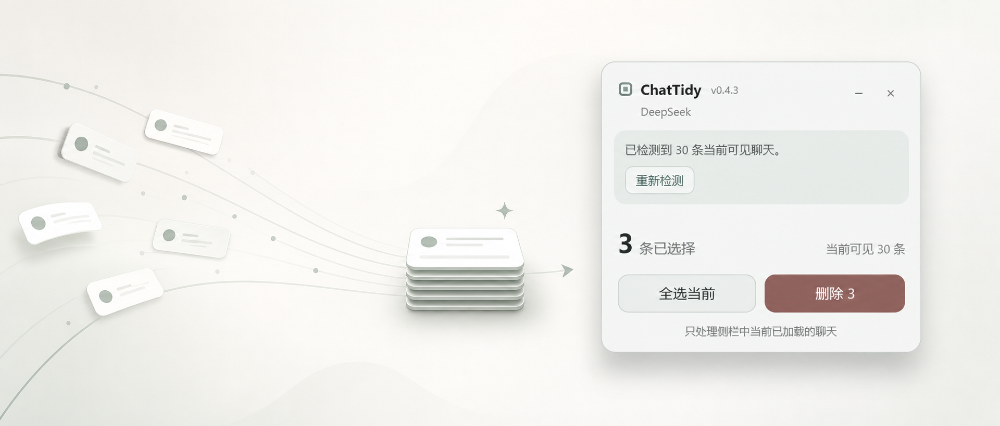

<p align="center">
  
</p>

<h1 align="center">ChatSweep</h1>

<p align="center">
  在多个 AI 聊天网站中，安全地批量选择并删除当前可见的聊天记录。
</p>

<p align="center">
  <a href="https://github.com/RusselLeekok/ChatSweep/actions/workflows/ci.yml"></a>
  <a href="https://github.com/RusselLeekok/ChatSweep/releases/latest"></a>
  <a href="LICENSE"></a>
</p>

## 功能

- 批量勾选侧栏中当前已经加载的聊天。
- 删除前显示数量和标题预览，降低误删风险。
- 调用网站原生菜单与确认窗口，不直接访问网站内部接口。
- 页面结构不匹配时自动进入安全模式，不猜测删除按钮。
- 所有处理均在本地浏览器中完成，不上传聊天数据。

目前支持 ChatGPT、Grok、Gemini、DeepSeek 和豆包。

## 安装

1. 打开 [Releases](https://github.com/RusselLeekok/ChatSweep/releases/latest)。
2. 下载最新的 `ChatSweep-版本号.zip`。
3. 将 zip 完整解压到一个固定目录。
4. 在 Chrome 中打开 `chrome://extensions/`，或在 Edge 中打开 `edge://extensions/`。
5. 开启“开发者模式”。
6. 点击“加载已解压的扩展程序”，选择刚才解压出的目录。

> 浏览器不能直接加载 zip 文件，必须先解压。Release 压缩包的根目录已经包含 `manifest.json`，不需要安装 Node.js，也不需要自己构建。

## 使用

1. 打开受支持的 AI 网站并登录。
2. 点击网页右下角的扩展面板，或点击浏览器工具栏中的扩展图标。
3. 点击“选择聊天”并勾选需要处理的会话。
4. 点击“删除”，核对标题后确认。

扩展只处理侧栏中当前已经渲染的聊天，不会自动滚动加载全部历史记录。虚拟列表中尚未加载的会话不会被选择。

## 隐私与安全

- 不读取聊天正文。
- 不读取或保存登录令牌。
- 不连接开发者服务器。
- 不包含统计、广告或追踪代码。
- 删除动作通过页面可见的原生交互完成。

详细说明请参阅 [PRIVACY.md](PRIVACY.md)。

## 本地开发

需要 Node.js 20 或更高版本。

```bash
git clone git@github.com:RusselLeekok/ChatSweep.git
cd ChatSweep
npm ci
npm run check
```

常用命令：

```bash
npm run dev        # 监听源码变化并持续构建
npm run test       # 运行测试
npm run typecheck  # TypeScript 类型检查
npm run build      # 生成本地 dist
npm run check      # 类型检查、测试、构建与产物验证
```

`dist` 是可重复生成的构建产物，因此不会提交到 Git 仓库。

## 自动发布

推送形如 `v0.4.3` 的版本标签后，GitHub Actions 会自动：

1. 使用 `npm ci` 安装锁定版本的依赖。
2. 运行完整测试与构建检查。
3. 核对 Git 标签、`package.json` 和 `manifest.json` 的版本号。
4. 将 `dist` 内容压缩为 `ChatSweep-0.4.3.zip`。
5. 创建 GitHub Release 并上传压缩包。

发布新版本前，请同步修改：

- `package.json`
- `package-lock.json`
- `manifest.json`
- `src/version.ts`

然后创建并推送标签：

```bash
git tag v0.4.3
git push origin v0.4.3
```

## 项目结构

```text
src/        扩展源代码
tests/      自动化测试
assets/     图标与 README 图片
scripts/    构建和验证脚本
fixtures/   适配器测试页面
dist/       本地构建产物（Git 忽略）
```

## 说明

AI 网站会频繁调整页面结构。若扩展进入安全模式或无法识别会话，请在仓库中提交 Issue，并附上站点名称、扩展版本和问题截图。

本项目采用 [MIT License](LICENSE)。
